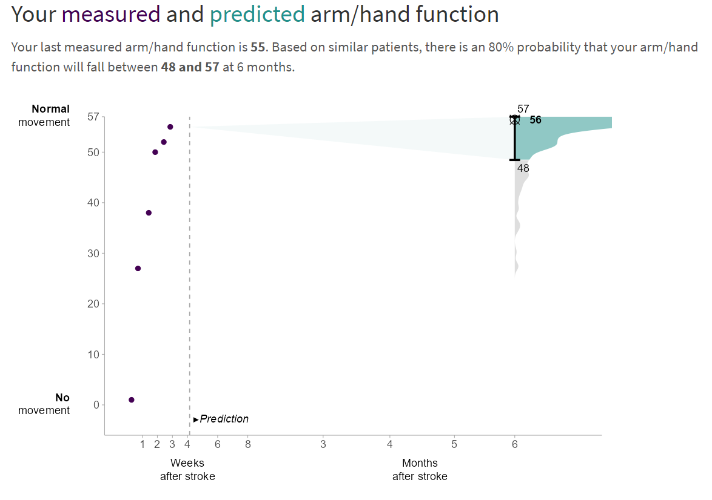

# Boostme Shiny App

We developed an XGBoost model that predicts patient-specific upper-extremity capacity at 6 months as measured with the ARAT. Measurements of up to 5 months of ARAT score, finger extension, shoulder abduction, and their time of measurement were included as predictors. Please refer to the [Boostme main branch](https://gitlab.com/radiology/igit/icai-stroke-lab/boostme)

This branch contains the Shiny application showcasing the XGBoost ARAT prediction model. The actual model is not included in this repository. Instead, model predictions for all possible combinations of predictor values are stored in App/R/XGBlookup.Rdata.

***To open the app run App/app.R***

Instructions for use are provided on the home screen.

### Disclaimer

This tool is currently a research tool and not yet suitable for clinical use.

### Description of functions:

-   **App/app** - main script, run to open app
-   **App/server** - shiny server function
-   **App/ui**- shiny ui function
-   **App/global** - loading libraries and data
-   **App/R/check_data** - checks if uploaded patient data complies to formatting requirements
-   **App/R/lookup** - looks up the predicted value and PI interval for the uploaded patient
-   **App/R/genPlot** - generates the output plot

### Visuals

### Authors and acknowledgment

By Govert van der Gun, adapted from [Elrozy Andrinopoulou.](https://emcbiostatistics.shinyapps.io/DynamicPredictionARATapp/)

### License

Copyright (c) 2024 ICAI Stroke Lab

Permission is hereby granted, free of charge, to any person obtaining a copy of this software and associated documentation files (the "Software"), to deal in the Software without restriction, including without limitation the rights to use, copy, modify, merge, publish, distribute, sublicense, and/or sell copies of the Software, and to permit persons to whom the Software is furnished to do so, subject to the following conditions:

The above copyright notice and this permission notice shall be included in all copies or substantial portions of the Software.

THE SOFTWARE IS PROVIDED "AS IS", WITHOUT WARRANTY OF ANY KIND, EXPRESS OR IMPLIED, INCLUDING BUT NOT LIMITED TO THE WARRANTIES OF MERCHANTABILITY, FITNESS FOR A PARTICULAR PURPOSE AND NONINFRINGEMENT. IN NO EVENT SHALL THE AUTHORS OR COPYRIGHT HOLDERS BE LIABLE FOR ANY CLAIM, DAMAGES OR OTHER LIABILITY, WHETHER IN AN ACTION OF CONTRACT, TORT OR OTHERWISE, ARISING FROM, OUT OF OR IN CONNECTION WITH THE SOFTWARE OR THE USE OR OTHER DEALINGS IN THE SOFTWARE.
